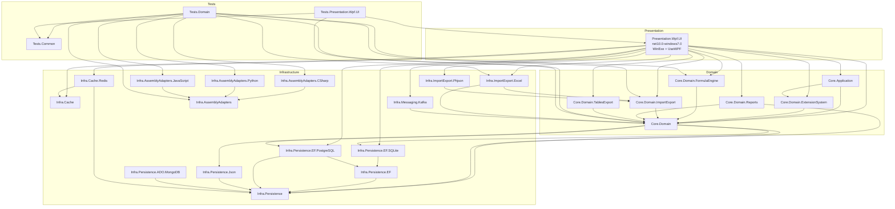

# 01 — Текущая архитектура

> **Статус:** Аналитическая фаза. Дата: 2026-06-02.

---

## Структура решения

**Файл:** `Philadelphus.sln`
- Visual Studio 2022 (версия 18)
- 26 проектов в 3 папках: Core, Infrastructure, Presentation, Tests

### Проекты по слоям

#### Domain (7 проектов, net10.0)

| Проект | Назначение | Зависит от |
|---|---|---|
| `Philadelphus.Core.Domain` | Сущности, интерфейсы, бизнес-правила | Infrastructure.Persistence (EF.SQLite, EF.PostgreSQL, Json) |
| `Philadelphus.Core.Domain.ExtensionSystem` | Система плагинов | Core.Domain |
| `Philadelphus.Core.Domain.FormulaEngine` | Движок формул | Core.Domain |
| `Philadelphus.Core.Domain.ImportExport` | Абстракции импорта/экспорта | Core.Domain |
| `Philadelphus.Core.Domain.Reports` | Отчёты | Core.Domain, Infrastructure.Persistence |
| `Philadelphus.Core.Domain.TablesExport` | Экспорт таблиц (DocumentFormat.OpenXml) | Core.Domain |
| `Philadelphus.Core.Application` | Application services, AutoMapper | Core.Domain, ExtensionSystem |

**Замечание:** `Core.Domain` ссылается напрямую на инфраструктурные проекты — это нарушение принципа инверсии зависимостей (Domain не должен знать об Infrastructure). Не связано с Avalonia, но фиксируется как архитектурный дефект.

#### Infrastructure (14 проектов, net10.0, кроме аномалии)

| Группа | Проекты |
|---|---|
| Persistence abstraction | `Philadelphus.Infrastructure.Persistence` |
| Persistence implementations | `.EF`, `.EF.PostgreSQL`, `.EF.SQLite`, `.Json` |
| ADO implementations | `.ADO.MongoDB` (net10.0), `.ADO.PostgreSQL` (**мёртвый артефакт, не в .sln**) |
| Caching | `.Cache`, `.Cache.Redis` |
| Import/Export | `.ImportExport.Excel`, `.ImportExport.Phjson` |
| Messaging | `.Messaging.Kafka` |
| Assembly adapters | `.AssemblyAdapters`, `.AssemblyAdapters.CSharp`, `.AssemblyAdapters.Python`, `.AssemblyAdapters.JavaScript` |

#### Presentation (1 проект, net10.0-windows7.0)

| Проект | Описание |
|---|---|
| `Philadelphus.Presentation.Wpf.UI` | WPF-клиент. UseWPF=true. WinExe. Ссылается на 13 других проектов. |

#### Tests (3 проекта)

| Проект | TFM | Описание |
|---|---|---|
| `Philadelphus.Tests.Common` | net10.0 | Общие утилиты, фикстуры |
| `Philadelphus.Tests.Domain` | net10.0 | 280 тестов (256✅ / 24❌ pre-existing) |
| `Philadelphus.Tests.Presentation.Wpf.UI` | net10.0-windows7.0 | 1 файл: ChildCollectionTableBuilderTests |

---

## Диаграмма текущих зависимостей



---

## Startup flow

```
App.OnStartup()
  │
  ├─ Allocate console (DllImport kernel32: AllocConsole) [Windows-only]
  ├─ IHost.CreateDefaultBuilder()
  │   ├─ .UseSerilog(...)             — файл + консоль
  │   ├─ .ConfigureAppConfiguration() — appsettings.json + 3 внешних config-файла
  │   └─ .ConfigureServices()         — 455 строк DI-регистраций
  │
  ├─ _host.StartAsync()
  ├─ Реконфигурация Serilog (только файл, консоль освобождается)
  ├─ FreeConsole() [Windows-only]
  │
  ├─ SplashWindow (Singleton из DI)
  │   ├─ .Show() / .Activate()
  │   ├─ StartAnimations()            — Storyboard, DispatcherTimer, BeginInvoke
  │   └─ InitializeApplicationAsync() — симулированные фазы Init→Load→Prepare
  │       └─ CloseWithAnimation()
  │           └─ LaunchWindow.Show()
  │
  ├─ LaunchWindow (Singleton из DI)
  │   ├─ DataContext = LaunchWindowVM
  │   ├─ 5 вкладок: Main, Create, Open, Settings, Storages
  │   └─ OnClosing: если MainWindow открыто → Hide (не закрывать)
  │
  └─ MainWindow (Transient через DI)
      ├─ DataContext устанавливает IMainWindowVMFactory
      ├─ Multi-instance: несколько MainWindow могут быть открыты одновременно
      └─ OnClosing: если нет других MainWindow → Application.Current.Shutdown()

App.OnExit()
  └─ _host.StopAsync() + Log.CloseAndFlush()
```

---

## WPF-проект: внутренняя структура

```
Philadelphus.Presentation.Wpf.UI/
├── App.xaml                          ← Resources: converters, icons, buttons, styles
├── App.xaml.cs                       ← DI setup (455 строк), OnStartup, OnExit
├── appsettings.json                  ← Serilog, Kafka, Redis, config paths
├── Behaviors/                        ← 8 behaviors (DataGrid, FormulaBar)
├── Converters/                       ← 13 converters
├── Factories/                        ← 4 factory interfaces + implementations
├── Infrastructure/                   ← RelayCommand, AsyncRelayCommand
├── Mapping/                          ← ViewModelsMappingProfile (AutoMapper)
├── Models/                           ← ParallelObservableCollectionVM
├── Services/                         ← 10 services (dialog, config, import pipeline)
├── ViewModels/                       ← 47 ViewModels
│   ├── ViewModelBase.cs
│   ├── ApplicationVM.cs
│   ├── ApplicationCommandsVM.cs
│   ├── ApplicationWindowsVM.cs
│   ├── ControlsVMs/                  ← 15 control ViewModels
│   ├── EntitiesVMs/                  ← 22 entity ViewModels
│   └── ImportExport/                 ← 5 import/export ViewModels
└── Views/
    ├── Windows/                      ← 10 Windows (XAML + code-behind)
    └── Controls/                     ← 25+ UserControls
```

---

## Обнаруженные архитектурные нарушения

### Критические (блокируют создание shared Presentation)

| # | Нарушение | Файлы | Количество |
|---|---|---|---|
| A1 | `CommandManager.RequerySuggested` в командах (WPF-only) | `Infrastructure/RelayCommand.cs:14`, `AsyncRelayCommand.cs:19` | 2 |
| A2 | `System.Windows.Visibility` как тип возврата свойств в ViewModels | `RepositoryExplorerControlVM.cs`, `ImportExportControlVM.cs` и др. | 17 файлов |
| A3 | `MessageBox.Show()` прямо в ViewModels и сервисах | `ImportExportControlVM.cs:236`, `ApplicationSettingsControlVM.cs` (5x), `RepositoryCreationControlVM.cs`, и др. | 18+ мест |
| A4 | `Application.Current.Dispatcher.Invoke/BeginInvoke` в ViewModels | `ImportExportControlVM.cs:360,372`, `MessageLogControlVM.cs:167,180,188` | 3 файла |
| A5 | `DispatcherTimer` в ViewModel | `MessageLogControlVM.cs:27` | 1 файл |
| A6 | `Application.Current.Resources` в Converter | `KeyToImageConverter.cs` | 1 файл |
| A7 | Прямое создание окна в ViewModel (`new DetailsWindow()`) | `MainWindowVM.cs` | 1 файл |

### Умеренные (ожидаемые, но требуют изоляции)

| # | Нарушение | Файлы |
|---|---|---|
| B1 | Логика инициализации/анимации в code-behind (340 строк) | `SplashWindow.xaml.cs` |
| B2 | Window lifecycle в code-behind | `MainWindow.xaml.cs`, `LaunchWindow.xaml.cs` |
| B3 | `AllocConsole`/`FreeConsole` DllImport | `App.xaml.cs` |
| B4 | `pack://application:,,,/` URI в Converter | `MainEntityToIconConverter.cs` |
| B5 | `System.Drawing.Imaging.BitmapImage` в Converter | `MainEntityToIconConverter.cs` |

### Уже хорошо изолировано (переносимо)

- `ViewModelBase.cs` — только `System.ComponentModel`, чистый
- DI через `Microsoft.Extensions.DependencyInjection` + IHost
- Serilog (без UI-зависимостей)
- Все Domain и Infrastructure проекты — net10.0, без WPF
- `IFileDialogService`, `IMessageDialogService` уже есть (в Excel pipeline)
- AutoMapper профили — переносимые
- `appsettings.json` конфигурация — переносимая

---

## Конфигурация и внешние зависимости

**Файлы конфигурации:**
- `appsettings.json` в проекте
- `%USERPROFILE%\AppData\Local\Philadelphus\Configuration\connection-strings-config.json`
- `%USERPROFILE%\AppData\Local\Philadelphus\Configuration\storages-config.json`
- `%USERPROFILE%\AppData\Local\Philadelphus\Configuration\repository-headers-config.json`

**Внешние сервисы (требуются при запуске):**
- Redis: `localhost:6379`
- Kafka: `localhost:9092` (MessagingUser, Notification)
- PostgreSQL: через строки подключения из конфига
- SQLite: локальные файлы

**Подпись сборки:** `<SignAssembly>True</SignAssembly>` включена в WPF-проекте. Файл ключа: `philadelphus.snk`.
