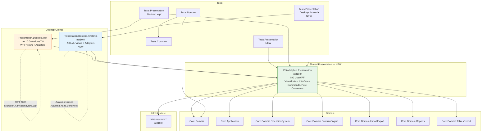

# 03 — Целевая архитектура

> **Статус:** Аналитическая фаза. Дата: 2026-06-02.

---

## Соглашение о наименовании (подтверждено)

```
Philadelphus.Presentation.Desktop.Wpf      ← WPF-клиент
Philadelphus.Presentation.Desktop.Avalonia ← Avalonia-клиент
Philadelphus.Presentation                  ← Shared ViewModel layer
```

Паттерн масштабируется: `Philadelphus.Presentation.Web`, `Philadelphus.Presentation.Mobile` и т.д.

---

## Целевая структура проектов

```
Philadelphus.sln
│
├── Core/
│   ├── Philadelphus.Core.Domain                    (без изменений)
│   ├── Philadelphus.Core.Domain.ExtensionSystem     (без изменений)
│   ├── Philadelphus.Core.Domain.FormulaEngine       (без изменений)
│   ├── Philadelphus.Core.Domain.ImportExport        (без изменений)
│   ├── Philadelphus.Core.Domain.Reports             (без изменений)
│   ├── Philadelphus.Core.Domain.TablesExport        (без изменений)
│   └── Philadelphus.Core.Application               (без изменений)
│
├── Infrastructure/
│   ├── Philadelphus.Infrastructure.Persistence.*    (без изменений)
│   ├── Philadelphus.Infrastructure.Cache.*          (без изменений)
│   ├── Philadelphus.Infrastructure.ImportExport.*   (без изменений)
│   ├── Philadelphus.Infrastructure.Messaging.Kafka  (без изменений)
│   └── Philadelphus.Infrastructure.AssemblyAdapters.* (без изменений)
│
├── Presentation/
│   ├── Philadelphus.Presentation                    (НОВЫЙ — net10.0, НЕТ UseWPF)
│   ├── Philadelphus.Presentation.Desktop.Wpf        (переименован из Presentation.Wpf.UI)
│   └── Philadelphus.Presentation.Desktop.Avalonia   (НОВЫЙ — net10.0)
│
└── Tests/
    ├── Philadelphus.Tests.Domain                     (без изменений)
    ├── Philadelphus.Tests.Common                     (без изменений)
    ├── Philadelphus.Tests.Presentation               (НОВЫЙ — net10.0)
    ├── Philadelphus.Tests.Presentation.Desktop.Wpf   (переименован)
    └── Philadelphus.Tests.Presentation.Desktop.Avalonia (НОВЫЙ — net10.0)
```

---

## Диаграмма целевых зависимостей



---

## Правила ссылок

### Разрешённые зависимости

| От | К | Причина |
|---|---|---|
| `Presentation.Desktop.Wpf` | `Presentation` | Реиспользует shared ViewModels |
| `Presentation.Desktop.Avalonia` | `Presentation` | Реиспользует shared ViewModels |
| `Presentation` | `Core.*`, `Infrastructure.*` | Бизнес-логика и сервисы |
| `Tests.Presentation` | `Presentation` | Unit-тесты ViewModels |
| `Tests.Presentation.Desktop.Wpf` | `Presentation`, `Presentation.Desktop.Wpf` | Интеграционные тесты WPF |
| `Tests.Presentation.Desktop.Avalonia` | `Presentation`, `Presentation.Desktop.Avalonia` | Headless Avalonia UI тесты |

### **Запрещённые зависимости**

| Запрет | Причина |
|---|---|
| `Presentation` → `Avalonia.*` | Общий слой не должен знать о Avalonia |
| `Presentation` → `System.Windows.*` | Общий слой не должен знать о WPF |
| `Presentation` → `PresentationCore`, `PresentationFramework`, `WindowsBase` | WPF-сборки |
| `Presentation.Desktop.Avalonia` → `System.Windows.*` | Cross-contamination |
| `Presentation.Desktop.Wpf` → `Avalonia.*` | Cross-contamination |
| `Core.*` → `Presentation.*` | Domain не знает о Presentation |
| `Infrastructure.*` → `Presentation.*` | Инфраструктура не знает о Presentation |

### Автоматическая проверка (analyzer rule)

После создания `Philadelphus.Presentation` рекомендуется добавить `TargetFramework: net10.0` без `<UseWPF>`. Попытка добавить `using System.Windows` вызовет ошибку компиляции.

---

## Содержимое `Philadelphus.Presentation` (shared)

### Что входит

```
Philadelphus.Presentation/
├── ViewModels/
│   ├── ViewModelBase.cs
│   ├── ApplicationVM.cs              (после очистки от WPF)
│   ├── ApplicationCommandsVM.cs      (после очистки)
│   ├── ControlsVMs/                  (47 ViewModels после очистки)
│   └── EntitiesVMs/
├── Infrastructure/
│   ├── IRelayCommand.cs              (интерфейс)
│   └── IAsyncRelayCommand.cs         (интерфейс)
├── Services/
│   ├── Interfaces/
│   │   ├── IDialogService.cs         (NEW — замена MessageBox)
│   │   ├── IDispatcherService.cs     (NEW — замена Dispatcher)
│   │   ├── IWindowService.cs         (NEW — создание/управление окнами)
│   │   ├── INavigationService.cs     (NEW — если нужен)
│   │   ├── IFileDialogService.cs     (уже существует, переносится)
│   │   ├── IMessageDialogService.cs  (уже существует, переносится)
│   │   └── IConfigurationService.cs  (переносится)
│   └── Implementations/
│       └── ConfigurationService.cs   (после замены MessageBox на IDialogService)
├── Converters/
│   └── (только чистая логика без UI-типов)
│       ├── EnumDisplayAttributeLogic.cs
│       ├── LastLaunchToDaysAgoLogic.cs
│       └── UtcToLocalTimeLogic.cs
├── Factories/
│   ├── Interfaces/                    (все factory interfaces)
│   └── (реализации — в Desktop.Wpf и Desktop.Avalonia)
└── Mapping/
    └── ViewModelsMappingProfile.cs    (AutoMapper — переносимый)
```

### Что НЕ входит

- XAML / AXAML файлы
- Классы `Window`, `UserControl`, `Page`
- WPF: `Brush`, `BitmapImage`, `Visibility`, `Dispatcher`, `DispatcherTimer`, `CommandManager`
- Avalonia: `AvaloniaObject`, `IControl`, `IDataTemplate`
- `System.Windows.*` (любые)
- `Avalonia.*` (любые)
- `Application.Current`
- Обращение к UI-ресурсам напрямую

---

## Интерфейсы адаптеров

### `IDialogService`

```csharp
public interface IDialogService
{
    void ShowError(string message, string title = "Ошибка");
    void ShowWarning(string message, string title = "Предупреждение");
    void ShowInfo(string message, string title = "Информация");
    bool Confirm(string message, string title = "Подтверждение");
}
```

**WPF-реализация:** `System.Windows.MessageBox.Show()` → в `Presentation.Desktop.Wpf`
**Avalonia-реализация:** кастомный диалог или `DialogHost` → в `Presentation.Desktop.Avalonia`

### `IDispatcherService`

```csharp
public interface IDispatcherService
{
    void Invoke(Action action);
    Task InvokeAsync(Action action);
    void BeginInvoke(Action action);
}
```

**WPF-реализация:** `Application.Current.Dispatcher.Invoke/BeginInvoke`
**Avalonia-реализация:** `Dispatcher.UIThread.Invoke/InvokeAsync`

### `IWindowService`

```csharp
public interface IWindowService
{
    void ShowWindow<TViewModel>(TViewModel viewModel) where TViewModel : ViewModelBase;
    bool? ShowDialog<TViewModel>(TViewModel viewModel) where TViewModel : ViewModelBase;
    void CloseWindow(ViewModelBase viewModel);
}
```

**WPF-реализация:** регистрирует тип ViewModel → тип Window, создаёт через DI
**Avalonia-реализация:** регистрирует тип ViewModel → тип Window/Dialog

### `IRelayCommand` / `IAsyncRelayCommand`

```csharp
public interface IRelayCommand : ICommand
{
    void RaiseCanExecuteChanged();
}

public interface IAsyncRelayCommand : IRelayCommand
{
    bool IsExecuting { get; }
}
```

---

## Содержимое `Philadelphus.Presentation.Desktop.Wpf`

```
Philadelphus.Presentation.Desktop.Wpf/
├── App.xaml                                 (Resources)
├── App.xaml.cs                              (DI setup, OnStartup)
├── Infrastructure/
│   ├── RelayCommand.cs                      (CommandManager-based)
│   └── AsyncRelayCommand.cs                 (CommandManager-based)
├── Services/
│   └── Implementations/
│       ├── WpfDialogService.cs              (MessageBox)
│       ├── WpfDispatcherService.cs          (System.Windows.Dispatcher)
│       ├── WpfWindowService.cs              (Window creation via DI)
│       └── ExcelImportUiServices.cs         (Microsoft.Win32 dialogs)
├── Converters/
│   └── (все 13 WPF-конвертеров)
├── Behaviors/
│   └── (все 8 WPF-behaviors)
├── Factories/
│   └── Implementations/
│       └── (WPF factory implementations)
└── Views/
    ├── Windows/                             (все .xaml + .xaml.cs)
    └── Controls/                            (все UserControl .xaml + .xaml.cs)
```

---

## Содержимое `Philadelphus.Presentation.Desktop.Avalonia` (целевое)

```
Philadelphus.Presentation.Desktop.Avalonia/
├── App.axaml                                (Resources, avares:// URIs)
├── App.axaml.cs                             (Avalonia bootstrap, DI setup)
├── Infrastructure/
│   ├── AvaloniaRelayCommand.cs              (без CommandManager)
│   └── AvaloniaAsyncRelayCommand.cs
├── Services/
│   └── Implementations/
│       ├── AvaloniaDialogService.cs         (Avalonia dialogs)
│       ├── AvaloniaDispatcherService.cs     (Dispatcher.UIThread)
│       ├── AvaloniaWindowService.cs
│       └── AvaloniaFileDialogService.cs     (StorageProvider.OpenFilePickerAsync)
├── Converters/
│   └── (Avalonia-версии конвертеров, реализующие IValueConverter из Avalonia)
├── Behaviors/
│   └── (Avalonia.Xaml.Interactions-based behaviors)
├── Assets/
│   └── Icons/                               (PNG или SVG)
└── Views/
    ├── Windows/
    └── Controls/
```

---

## Правила чистого MVVM

1. **ViewModel не создаёт и не открывает окна напрямую.** Использует `IWindowService`.
2. **ViewModel не вызывает `MessageBox`.** Использует `IDialogService`.
3. **ViewModel не обращается к `Dispatcher`.** Использует `IDispatcherService`.
4. **ViewModel не возвращает `Visibility`.** Возвращает `bool`. View использует конвертер или привязку.
5. **ViewModel не знает о `Brush`, `BitmapImage`, `Color`.** Только строковые или enum-значения.
6. **Code-behind содержит только `InitializeComponent()`.** Вся логика в ViewModel.
7. **Команды создаются через интерфейс.** Конкретная реализация `IRelayCommand` — в платформенном проекте.
8. **Исключение:** Window lifecycle (OnClosing, OnActivated) — допустимо в code-behind при делегировании в сервис.

---

## Темы: архитектура ресурсов

Целевая система тем: три режима — `System` (следовать ОС), `Light`, `Dark`.

```
Presentation.Desktop.Avalonia/
└── Assets/
    └── Themes/
        ├── LightTheme.axaml     ← Light-specific colors and styles
        ├── DarkTheme.axaml      ← Dark-specific colors and styles
        └── CommonTheme.axaml    ← Platform-independent layout/typography

App.axaml:
  <Application.Styles>
    <FluentTheme />              ← Avalonia built-in (поддерживает Light/Dark)
    <StyleInclude Source="avares://...Themes/CommonTheme.axaml" />
  </Application.Styles>
```

**Переключение:** `Application.Current.RequestedThemeVariant` (Avalonia 11.1+) или кастомная реализация.
**Кастомные цвета:** определяются как `ThemeVariant`-aware ресурсы в `LightTheme.axaml` / `DarkTheme.axaml`.

**Иконки:** переход с PNG (`pack://`) на `avares://` URI. Оценить переход на SVG в рамках Этапа 9 (отдельный spike).

---

## Compiled Bindings (x:DataType)

**Рекомендация:** включать постепенно, начиная с Этапа 5 (SplashWindow).

| Ситуация | Рекомендация |
|---|---|
| ViewModels с known DataContext | Использовать `x:DataType` — ранее обнаруживаются ошибки привязки |
| DataTemplates с полиморфными типами | Пропустить или использовать `{CompiledBinding}` с явным cast |
| ItemsControl с гетерогенными элементами | `x:DataType` не обязателен, использовать `DataTemplate` |
| Первый вертикальный срез (SplashWindow) | Использовать compiled bindings — minimal risk, helps validate approach |

Включение не блокирует миграцию — каждый файл опционален.
